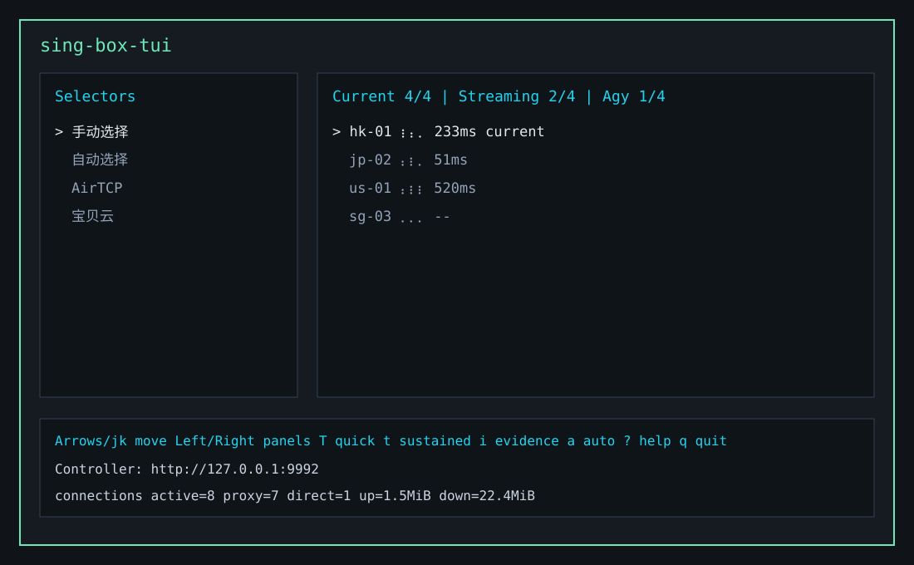

# sing-box-tui

Terminal UI for managing sing-box selector nodes, latency tests, subscription
refresh, bypass rules, and OS system proxy settings.



## Quick start on Windows

Install the latest prebuilt Windows release:

```powershell
irm https://raw.githubusercontent.com/winter-loo/sing-box-tui/main/scripts/windows/install.ps1 | iex
```

If raw GitHub access is blocked, fetch the installer through the proxy URL:

```powershell
irm https://deeloo.cn/anywhere/https://raw.githubusercontent.com/winter-loo/sing-box-tui/main/scripts/windows/install.ps1 | iex
```

The installer downloads the latest `sing-box-tui` Windows x64 release with
multi-part parallel downloads when the server supports byte ranges. It installs
under `%LOCALAPPDATA%\sing-box-tui`, adds that directory to the user `PATH`, and
installs `sing-box` from the configured GitHub release when it is missing. If a
direct GitHub download fails, the installer retries through the configured
`https://deeloo.cn/anywhere` proxy.

From a local checkout, you can run:

```powershell
powershell.exe -NoProfile -ExecutionPolicy Bypass -File scripts\windows\install.ps1 -AddToPath
```

Use `-DownloadParts 1` to disable parallel downloading. Disable the GitHub
proxy fallback with `-GitHubProxy ""`, override it with another prefix URL,
or use `-ForceGitHubProxy` to route all GitHub requests through it without a
direct attempt:

```powershell
powershell.exe -NoProfile -ExecutionPolicy Bypass -File scripts\windows\install.ps1 -DownloadParts 1
powershell.exe -NoProfile -ExecutionPolicy Bypass -File scripts\windows\install.ps1 -GitHubProxy ""
powershell.exe -NoProfile -ExecutionPolicy Bypass -File scripts\windows\install.ps1 -GitHubProxy "https://example.com/anywhere"
powershell.exe -NoProfile -ExecutionPolicy Bypass -File scripts\windows\install.ps1 -ForceGitHubProxy
powershell.exe -NoProfile -ExecutionPolicy Bypass -File scripts\windows\install.ps1 -SingBoxDir "D:\Tools\sing-box"
```

Start the TUI:

```powershell
sing-box-tui run
```

By default, `run` finds `sing-box` through `PATH`. To use a core installed
elsewhere or with a custom filename, specify its executable path:

```powershell
sing-box-tui run --sing-box "D:\Tools\sing-box\sing-box.exe"
```

On first launch, the TUI shows a setup wizard. Paste a sing-box subscription URL
to create `.suburl`, or press `s` to skip. Press `o` later to open TUI settings.

## Prebuilt releases

Tagged releases build these archives automatically:

- Windows x64: `sing-box-tui-<version>-x86_64-pc-windows-msvc.zip`
- Linux x64: `sing-box-tui-<version>-x86_64-unknown-linux-gnu.tar.gz`
- macOS Apple Silicon: `sing-box-tui-<version>-aarch64-apple-darwin.tar.gz`
- macOS Intel: `sing-box-tui-<version>-x86_64-apple-darwin.tar.gz`

## Internet Route Source Sync

`sync` logs into an Internet Route source website, downloads the sing-box subscription JSON, and merges route nodes into your local sing-box config.

Example:

```bash
cargo run -- sync \
  --provider https://3.airtcp.me \
  --account-file ./provider-account.txt \
  --config ./config.json \
  --subscription-output ./output/airtcp-singbox.json

cargo run -- sync \
  --provider https://3.airtcp.me \
  --account-file ./provider-account.txt \
  --config ./config.json \
  --output ./output/merged-config.json

cargo run -- sync \
  --provider https://3.airtcp.me \
  --account-file ./provider-account.txt \
  --config ./config.json \
  --write
```

`sync` is safe by default: it will not overwrite the live config unless you pass `--write`. Otherwise, use `--output` to write the merged config somewhere else.

If you already have a direct sing-box subscription URL, use `subscribe` instead of `sync`:

```bash
cargo run -- subscribe \
  --url 'https://h.bbydy.org/api/bby/client/subscribe?token=REDACTED' \
  --config ./config.json \
  --output ./output/merged-config.json \
  --replace-nodes
```

`subscribe` fetches the URL with a `sing-box` user agent, extracts real node outbounds from the subscription JSON, filters source metadata entries, and merges the nodes into the selector/urltest groups from the template config.

Generated default configs omit remote `geoip-cn`, `geosite-*`, and
`AdGuardSDNSFilter` rule-sets by default so startup does not depend on fetching
GitHub-hosted `.srs` files. They also omit TUN mode by default. Add
`--include-geosite-rules` to `import`, `subscribe`, `subscriptions`, `sync`, or
`run` if you explicitly want those remote rules in a newly created default
config. Add `--include-tun-mode` if you explicitly want a TUN inbound in a newly
created default config. Existing configs keep whatever rule-sets and inbounds
they already contain.

To import one or more Internet Route source subscription URLs, copy the sing-box subscription
URL from the source website and save it in a local `.suburl` file. Each line
uses `source name = subscription url`:

```text
baobeiyun = https://example.com/api/subscribe?token=REDACTED
airtcp = https://spring.mailrelay.us/link/REDACTED?singbox=1
```

Then refresh those subscriptions into a config:

```bash
cargo run -- subscriptions \
  --input .suburl \
  --cache .suburl.cache.json \
  --config ./config.json \
  --output ./output/refreshed-config.json
```

Keep `.suburl` private because source subscription URLs usually contain
account tokens.

Source helper scripts under `scripts/` can extract subscription URLs from an
already-authenticated Chrome tab through CDP. When Chrome runs on Windows and
the script runs inside WSL, start a separate Windows Chrome profile with CDP
enabled:

```powershell
& "$env:ProgramFiles\Google\Chrome\Application\chrome.exe" `
  --user-data-dir="$env:TEMP\chrome-cdp-profile-9229" `
  --remote-debugging-port=9229 `
  --remote-allow-origins=* `
  --new-window "https://5.airtcp.me/user"
```

On WSL2, current Chrome builds may still bind CDP to Windows `127.0.0.1` only.
Use `--cdp-windows-relay` to start a temporary PowerShell TCP relay from the
WSL-visible Windows host to that loopback CDP port:

```bash
python3 scripts/get-airtcp-singbox-url.py --cdp-windows-relay --list-pages-only
python3 scripts/get-airtcp-singbox-url.py --cdp-windows-relay
python3 scripts/get-baipiao-singbox-url.py --cdp-windows-relay
python3 scripts/get-baobeiyun-singbox-url.py --cdp-windows-relay
```

If Chrome is already listening on a WSL-reachable Windows address, use
`--cdp-windows` without the relay. Both modes resolve the Windows host IP from
WSL, rewrite loopback debugger WebSocket URLs when needed, and bypass shell
proxy variables for CDP HTTP calls. If WSL chooses the wrong host, pass it
explicitly:

```bash
python3 scripts/get-airtcp-singbox-url.py \
  --cdp-windows-relay \
  --windows-host "$(ip route show default | awk '{ print $3; exit }')"
```

You can also set `SING_BOX_TUI_CDP_URL` to change the default CDP endpoint. Keep
the CDP browser profile temporary and close that Chrome instance after use; a
reachable CDP port can control the attached browser profile.

Set `WSL_CDP_LOG=1` to print CDP helper diagnostics such as host resolution,
URL rewrites, and relay start/stop events.

For scheduled or repeated refreshes, use the same `subscriptions` command. It
refreshes sources at most once per day by default and updates only server node
outbounds in an existing config:

```bash
cargo run -- subscriptions \
  --input .suburl \
  --cache .suburl.cache.json \
  --config ./config.json \
  --output ./output/refreshed-config.json
```

Use `--write` instead of `--output` to overwrite `--config` in place, and `--force` to fetch even when the cached subscription payload is still fresh. The command stores downloaded subscription JSON in `.suburl.cache.json` so skipped daily runs can still refresh node outbound definitions from cached source configs. DNS, inbounds, routes, selectors, experimental settings, and other non-node config sections are preserved.

When the TUI is running, it also starts a background subscription refresh worker if `.suburl` exists. The worker runs once on startup, then checks again every day. It refreshes node outbounds in the configured sing-box config path and keeps the TUI responsive while network fetches are running:

```bash
cargo run -- run --config ./config.json
```

Set `SING_BOX_CONFIG=/path/to/config.json` or pass `--config` to control the write target. Use `--no-subscription-refresh` to disable the TUI worker and `--force-subscription-refresh` to fetch on startup even when the cache is fresh. After the worker writes a new config, restart or reload sing-box for the new nodes to become active in the running service.

Press `u` in the TUI to manually force-refresh subscription contents immediately. If a refresh is already running, the TUI keeps the existing worker and reports that the refresh is in progress.

Before overwriting the sing-box config, subscription refresh writes one fixed backup next to it: `<config filename>.sing-box-tui-subscription-backup`. Each refresh replaces that same backup file, so only one subscription-refresh backup is kept on disk.

Account file formats:

```text
email=your-email@example.com
password=your-password
```

or:

```text
your-email@example.com
your-password
```

Small terminal UI for switching `sing-box` selector outbounds through the Clash-compatible controller API.

The TUI keeps the original two-column layout when the selected selector has zero or one nested Internet Route selector. When the selected selector contains multiple child selector groups, it switches to a three-column layout:

```text
Selector Groups | Internet Routes | Nodes
```

Selecting a node inside an Internet Route group updates that child selector and then points the parent selector at that route group. This supports configs shaped like `手动选择 -> 宝贝云 -> node`.

## Installation

The platform installers install `sing-box-tui` and install the configured
`sing-box` core release when `sing-box` is not already on `PATH`. Set
`-SingBoxDir` on Windows or `--sing-box-dir` on macOS/Linux to install it in a
specific directory. When this option is set, the installer checks only that
directory for the `sing-box` executable instead of checking the global `PATH`.

Windows:

```powershell
scripts\windows\install.cmd
```

macOS/Linux:

```sh
scripts/install.sh
```

Useful Windows options:

```powershell
scripts\windows\install.cmd -Version v0.1.0
scripts\windows\install.cmd -SkipSingBox
scripts\windows\install.cmd -DownloadParts 1 -Force
scripts\windows\install.cmd -ForceGitHubProxy
scripts\windows\install.cmd -SingBoxDir "D:\Tools\sing-box"
```

Useful macOS/Linux options:

```sh
scripts/install.sh --check-only
scripts/install.sh --dry-run --force
scripts/install.sh --version v0.1.0 --force
scripts/install.sh --force-github-proxy
scripts/install.sh --github-proxy https://example.com/anywhere --force-github-proxy
scripts/install.sh --sing-box-dir "$HOME/.local/bin"
```

The Unix installer uses four parallel byte-range requests by default and falls
back to `https://deeloo.cn/anywhere` when GitHub is unavailable. If a network
or proxy does not handle ranges reliably, use a single request. The timeout
options control the total transfer time and how long a connection may make no
progress:

```sh
scripts/install.sh --download-parts 1
scripts/install.sh --download-timeout-sec 1800 --download-stall-timeout-sec 120
scripts/install.sh --github-proxy https://example.com/github-proxy
scripts/install.sh --github-proxy ""
```

Passing an empty GitHub proxy disables the fallback. Run
`scripts/install.sh --help` for all installer options and environment-variable
overrides.

## Requirements

- `sing-box` must expose `experimental.clash_api.external_controller`, usually `127.0.0.1:9992`
- The proxies you want to switch must be under at least one `selector` outbound
- Keep `experimental.cache_file.enabled = true` if you want `sing-box` to remember the last selection

Example config fragment:

```json
{
  "experimental": {
    "cache_file": {
      "enabled": true
    },
    "clash_api": {
      "external_controller": "127.0.0.1:9992",
      "secret": ""
    }
  }
}
```

## Run

```bash
cargo run -- run
```

Or point it at a different controller:

```bash
cargo run -- run --controller http://127.0.0.1:9992
```

Inside the TUI, use `/` to set a node-name filter such as `美国` or `美国,香港`, then press `a` to enable auto-pick for the selected selector group. Prefix a filter term with `!` or `-` to exclude matching nodes, for example `美国,!倍率` keeps US nodes except names containing `倍率`, and `!香港` keeps all nodes except names containing `香港`. Auto-pick always runs in a background worker controlled by the TUI over TCP JSON lines. The worker tests latency every 30 seconds and switches to the best healthy node only when the current node is outside the filter, fails, or is above 600ms. It does not rewrite the sing-box `urltest` outbound; it switches the selector to a concrete node through the controller API.

TUI latency results are written to SQLite at `./singbox.sqlite3` by default. Set `SING_BOX_TUI_DB=/path/to/singbox.sqlite3` to use a different database. Rows are stored in `benchmark_results` with timestamp, selector, node, filter, latency in milliseconds, completion state, and test kind (`group`, `single`, or `auto`).

TUI runtime state is written to `./sing-box-tui.json` by default. Set `SING_BOX_TUI_CONFIG=/path/to/sing-box-tui.json` to use a different file. The state file records the last latency filter, whether auto-pick is enabled, the auto-pick target selector, the current selected node for each selector group, and the last explicit TUN mode choice (so a regenerated config that lost the `tun` inbound is re-applied on the next startup). On startup, the TUI re-applies saved selector choices when the saved node still exists in that selector.

When auto-pick is enabled, the worker pid, TCP address, and token are recorded so `sing-box-tui background status` can query it and `sing-box-tui background stop` can stop it. Live TUI-to-worker interaction uses TCP while the registry file is only discovery data, not the live communication channel. Pressing `q` stops the worker together with the managed sing-box process; pressing `B` leaves sing-box, the worker, and active Private Access sessions running with their last applied settings. Starting the TUI again reconnects to the existing TCP-managed worker when auto-pick is enabled. Private Access sessions left by `B` are shown as `BACKGROUND` while the recorded profile pid is still alive.

The background control listener binds to `127.0.0.1:0` by default. Set `SING_BOX_TUI_BACKGROUND_BIND=HOST:PORT` to choose an address. Non-loopback addresses are rejected unless `SING_BOX_TUI_BACKGROUND_ALLOW_REMOTE=1` is also set, because the registry contains the control token.

TUI bypass entries are stored in that same state file and written to a sing-box source rule-set at `./sing-box-tui-bypass.json` by default. Set `SING_BOX_TUI_BYPASS_RULE_SET=/path/to/sing-box-tui-bypass.json` to use a different file. Generated and merged configs reference this local rule-set near the top of `route.rules`, routing matched domains/IPs/CIDRs to `direct` / `国内直连`. If an older live config does not yet reference the rule-set, regenerate/merge the config and restart or reload sing-box once; after that, the local rule-set file can be edited by the TUI and sing-box will reload it.

Generated and merged configs also route `100.64.0.0/10` direct so Tailscale and
other CGNAT overlay addresses do not go through the proxy.

Generated and merged configs set selector/urltest `interrupt_exist_connections` to `false`, so switching nodes does not tear down existing connections. Existing connections keep their original outbound until they close or fail; new/retried connections use the current selection.

List selector groups through the Clash API:

```bash
cargo run -- selectors
cargo run -- selectors --selector select
```

Inspect live controller status, traffic, and active connections:

```bash
cargo run -- status
```

The TUI also shows active sing-box connection totals in the status area. Press `c` to open a live connection details panel showing the inbound type, target host/IP, outbound chain, and matched rule.

Environment variable still works too:

```bash
SING_BOX_CONTROLLER=http://127.0.0.1:9992 cargo run -- run
```

If the controller has a secret:

```bash
SING_BOX_SECRET='your-secret' cargo run
```

## Import Clash Nodes

Full `config.json` output:

```bash
cargo run -- import -i clash_proxies.txt -o config.json
```

Replace existing node outbounds instead of merging:

```bash
cargo run -- import -i clash_proxies.txt -o config.json --replace-nodes
```

Full-config behavior:

- If `./config.json` does not exist, the importer creates a complete workspace-local config with sane defaults:
  - mixed inbound on `127.0.0.1:6780`
  - `selector` outbound `select`
  - `urltest` outbound `auto`
  - `direct` and `block`
  - `route.final = "select"`
  - `experimental.clash_api` on `127.0.0.1:9992`
  - remote `geoip-cn`, `geosite-*`, and `AdGuardSDNSFilter` rule-sets only when `--include-geosite-rules` is passed
  - TUN inbound only when `--include-tun-mode` is passed
- If `./config.json` exists, the importer reads it and merges the imported nodes into that config by default.
- With `--replace-nodes`, the importer removes existing node outbounds first, then inserts the newly imported nodes.
- Existing `select`, `auto`, `direct`, and `block` outbounds are reused when present.
- Imported node tags replace same-tag outbounds and are appended otherwise.

Use a different source config path if needed:

```bash
cargo run -- import -i clash_proxies.txt --config ./config.json -o merged-config.json
```

Validate the generated config:

```bash
sing-box check -c config.json
```

## Manual Bypass Migration

Use this when you want to update an older `sing-box` config by hand so the TUI can manage direct-bypass domains, IPs, and CIDRs.

Add this local source rule-set to `route.rule_set`:

```json
{
  "type": "local",
  "tag": "sing-box-tui-bypass",
  "format": "source",
  "path": "sing-box-tui-bypass.json"
}
```

Add this route rule near the top of `route.rules`, after any DNS hijack rule and before normal proxy/direct rules:

```json
{
  "rule_set": "sing-box-tui-bypass",
  "outbound": "direct"
}
```

If your direct outbound tag is `国内直连`, use that instead:

```json
{
  "rule_set": "sing-box-tui-bypass",
  "outbound": "国内直连"
}
```

Create the rule-set file at the configured `path`:

```json
{
  "version": 1,
  "rules": []
}
```

Example with entries:

```json
{
  "version": 1,
  "rules": [
    {
      "domain_suffix": ["example.com", "github.com"]
    },
    {
      "ip_cidr": ["1.1.1.1", "10.0.0.0/8"]
    }
  ]
}
```

Validate and restart once:

```bash
sing-box check -c ./config.json
sudo systemctl restart sing-box
```

After the config references the local rule-set, press `b` in the TUI to edit bypass entries. The TUI writes `sing-box-tui-bypass.json`; new or retried connections use the updated direct-bypass rules.

## Benchmark Nodes

The former Python skill script is now built into the Rust app.

For a manual Internet Route source subscription workflow, including fetching a sing-box subscription JSON, converting legacy config syntax for local testing, benchmarking every node through the Clash API, and verifying real traffic, see [docs/subscription-benchmark.md](docs/subscription-benchmark.md).

For enterprise intranet access through an external Private Access service process,
including the Hillstone service, TUI settings, and troubleshooting, see
[docs/private-access-service.md](docs/private-access-service.md).

CLI examples:

```bash
cargo run -- benchmark
cargo run -- benchmark --max-concurrency 8
cargo run -- benchmark --selector select --match 美国 --switch
cargo run -- benchmark --match 美国 --switch --verify
cargo run -- benchmark --match 美国 --switch --verify --verify-url NAME=URL
cargo run -- run --max-concurrency 8
```

If `--match` is omitted, benchmarking runs without a substring filter. `--match` accepts the same comma-separated include/exclude syntax as the TUI filter, such as `美国,!倍率` or `!香港`. If `--max-concurrency` is omitted, benchmarks use a default cap of 16 concurrent delay probes. The same limit applies to CLI benchmarking and TUI group latency tests started with `T`.

JSON output includes:

- current selector target
- tested candidates
- per-node delay values
- best successful node
- whether a switch was applied
- final selected node
- optional verification summary

## Clash API Inspection

Two read-only controller commands are available in addition to the TUI latency flow:

- `selectors`: returns JSON for all selector groups, or one group with `--selector NAME`
- `status`: returns controller version, current traffic counters, aggregate connection totals, and active connection metadata

Detached auto-pick worker commands are available separately:

- `background status`: returns JSON for the live detached headless auto-pick worker
- `background stop`: stops that detached worker and disables saved auto-pick

## Keys

- `Up` / `Down` or `j` / `k`: move
- `Tab`, `h`, `l`, `Left`, `Right`: switch pane
- `Space`: apply/switch to the currently highlighted proxy in the current selector group
- `b`: edit direct-bypass domains, IPs, and CIDRs; values are comma-separated and are written to the local sing-box rule-set
- `B`: exit the TUI while keeping the managed sing-box process, auto-pick background worker, and active Private Access sessions running
- `p`: on Windows/macOS/Linux, toggle the system proxy for the sing-box mixed inbound
- `\`: toggle the Internet Proxy TUN mode; adds or removes the sing-box `tun` inbound in the configured `config.json` and restarts the managed sing-box process. On macOS/Linux this needs `sudo` (the TUI prompts with `sudo -v`); on Windows it needs an Administrator session.
- `Enter`: unused for selection
- `T`: asynchronously test latency for all nodes in the current selector/group using the current filter
- `t`: asynchronously test latency for only the currently highlighted node (with a light same-node debounce to avoid spammy rapid retests)
- `s`: toggle node sort order between `SELECTOR ORDER` and `LATENCY ORDER`; latency order hides failed-tested nodes and sorts successful tested nodes by ascending latency
- `a`: toggle auto-pick for the selected selector using the current filter; the background worker tests latency every 30 seconds and switches only when current latency is above 600ms, failed, or outside the filter
- `i`: show a SQLite-backed latency line chart for the highlighted node; x-axis is relative time in minutes or hours and y-axis is latency in ms. The chart refreshes from SQLite while open. Failed latency records are treated as gaps, so no point is drawn and the line breaks there.
- `z` / `Z`: while the latency chart is open, zoom in to the most recent values or zoom out to include less recent values
- `c`: show active sing-box connections, including inbound type, destination, outbound chain, and route rule; press `r` in this panel to refresh immediately
- `v`: immediately start configured background verification checks
- `o`: open TUI settings for latency, auto-pick, and system proxy values
- `/`: change the latency substring filter; comma-separated include values match any value, and `!` or `-` prefixes exclude values, for example `美国,香港,!倍率`
- `r`: refresh groups
- `?`: show the help modal; use `Up` / `Down`, `j` / `k`, or mouse wheel to browse it
- `q`: quit

During async latency tests, node rows show a brighter pending state (`...` plus a spinner marker) while a test is in progress, then show measured latency or `fail` when the test completes.

## System Proxy

The TUI can set the OS system proxy with `p`. On Windows, it updates the current
user's WinINET proxy:

```powershell
scripts\windows\set-system-proxy.cmd -Enable -Server 127.0.0.1:6780
```

When enabling the system proxy, TUI bypass entries are also written to the OS
proxy bypass list, alongside the default local/private and CGNAT overlay
network bypasses.

On macOS, it uses `networksetup` to update HTTP, HTTPS, and SOCKS proxies on
all enabled network services. To target specific macOS network services, set a
comma-separated service list:

```bash
SING_BOX_TUI_SYSTEM_PROXY_SERVICE="Wi-Fi,USB 10/100 LAN" cargo run -- run
```

On Linux, it uses `gsettings` to update the GNOME desktop proxy settings for
HTTP, HTTPS, and SOCKS:

```bash
gsettings set org.gnome.system.proxy mode manual
gsettings set org.gnome.system.proxy.http host 127.0.0.1
gsettings set org.gnome.system.proxy.http port 6780
gsettings set org.gnome.system.proxy.https host 127.0.0.1
gsettings set org.gnome.system.proxy.https port 6780
gsettings set org.gnome.system.proxy.socks host 127.0.0.1
gsettings set org.gnome.system.proxy.socks port 6780
```

The proxy server is detected from the configured sing-box JSON `mixed` inbound when possible. Override it with:

```powershell
$env:SING_BOX_TUI_SYSTEM_PROXY_SERVER = "127.0.0.1:6780"
```

To disable the Windows system proxy manually:

```powershell
scripts\windows\set-system-proxy.cmd -Disable
```

To disable the macOS system proxy manually for a service:

```bash
networksetup -setwebproxystate Wi-Fi off
networksetup -setsecurewebproxystate Wi-Fi off
networksetup -setsocksfirewallproxystate Wi-Fi off
```

To disable the Linux system proxy manually:

```bash
gsettings set org.gnome.system.proxy mode none
```

If you call the PowerShell script directly, pass a process-scoped execution policy override:

```powershell
powershell.exe -NoProfile -ExecutionPolicy Bypass -File scripts\windows\set-system-proxy.ps1 -Disable
```

## FAQ

### Why does the browser not use sing-box after I enable system proxy?

Check that the TUI status line shows system proxy enabled and that the detected
mixed inbound is correct. Press `o` to edit the system proxy server if your
sing-box mixed inbound is not `127.0.0.1:6780`.

### Why does `netsh winhttp show proxy` say no proxy is set on Windows?

On Windows, sing-box-tui updates the current user's WinINET proxy, which is the
proxy used by Windows Settings, Internet Options, and many desktop apps.
`netsh winhttp show proxy` reports the separate WinHTTP proxy used by some
services and command-line components, so it can still show direct access after
the system proxy is enabled.

To copy the current WinINET proxy into WinHTTP, run an elevated shell:

```powershell
netsh winhttp import proxy source=ie
```

To set or reset the WinHTTP proxy manually:

```powershell
netsh winhttp set proxy 127.0.0.1:6780
netsh winhttp reset proxy
```

Services such as Tailscale may not use the current user's WinINET proxy. If
Tailscale cannot reach the network after enabling the TUI system proxy, either
configure the WinHTTP proxy as above or configure an HTTP/HTTPS proxy for
Tailscale separately.

### What is the difference between bypass rules and system proxy bypass?

TUI bypass rules are written to `sing-box-tui-bypass.json` so sing-box can route
matching domains/IPs to direct. When system proxy is enabled, the same entries
are also written to the OS proxy bypass list so system-proxy-aware apps can skip
the local proxy for those targets.

### How do I restore the Windows proxy manually?

Run:

```powershell
scripts\windows\set-system-proxy.cmd -Disable
```

### What should I use: TUN mode or system proxy?

System proxy is easier to toggle and works for applications that respect OS
proxy settings. TUN mode captures more traffic but needs a sing-box config with
a TUN inbound and usually requires higher system permissions.

Press `\` in the TUI to toggle the Internet Proxy TUN mode. It adds or removes
the sing-box `tun` inbound (`tun-in`, `auto_route`/`strict_route`) in the
configured config and restarts the managed sing-box process. Toggling TUN on
requires `sudo` on macOS/Linux (the TUI runs `sudo -v` first) or an
Administrator session on Windows, because sing-box must create a network
interface and change routes. For manual config edits, see
[docs/tun-mode.md](docs/tun-mode.md).

### Why does the first-run wizard appear?

It appears until setup is completed or skipped. Paste a subscription URL to
create `.suburl`, or press `s` to mark onboarding complete. You can still edit
settings later with `o`.
